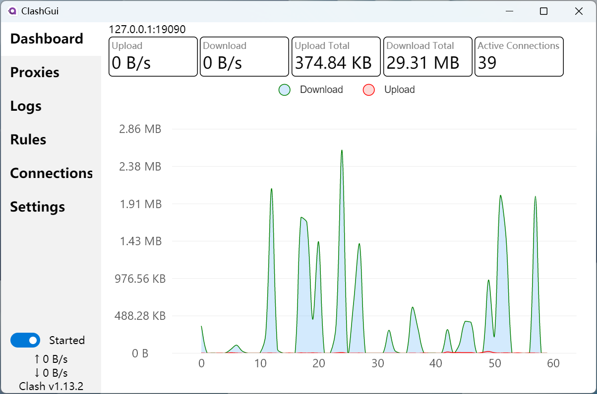
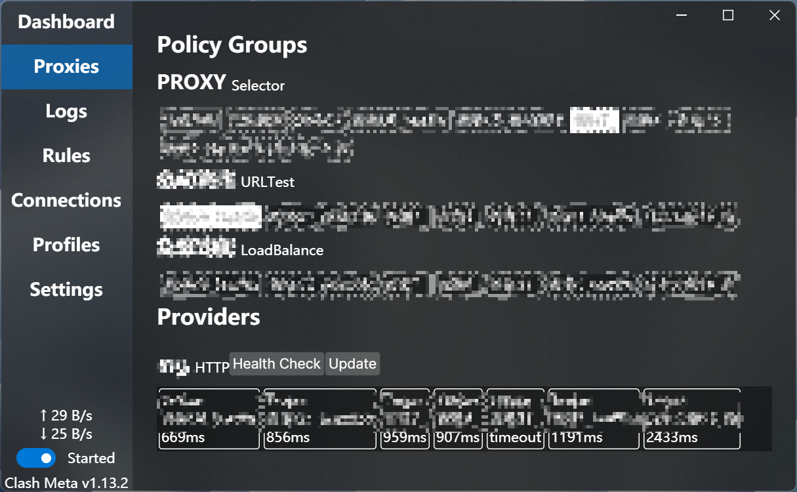
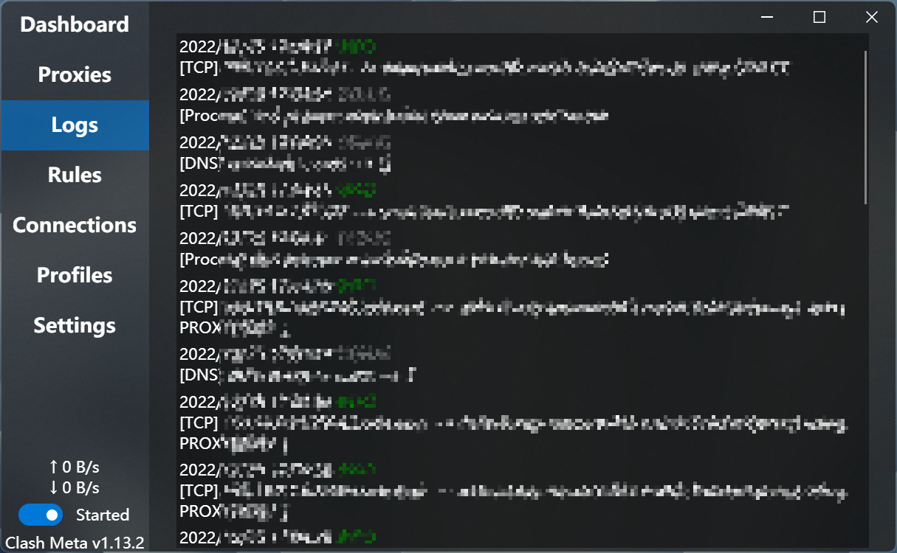
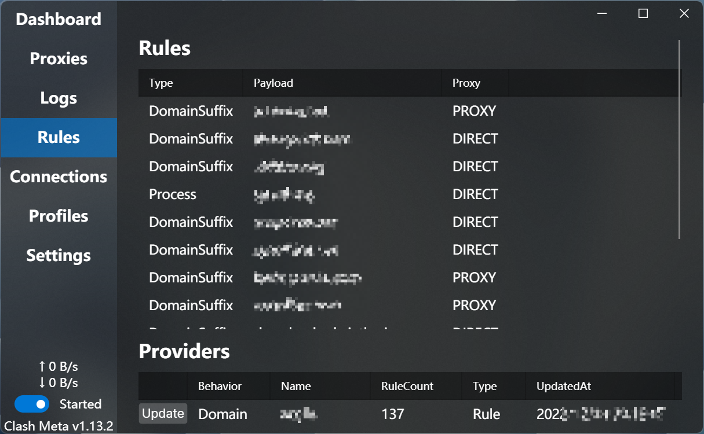
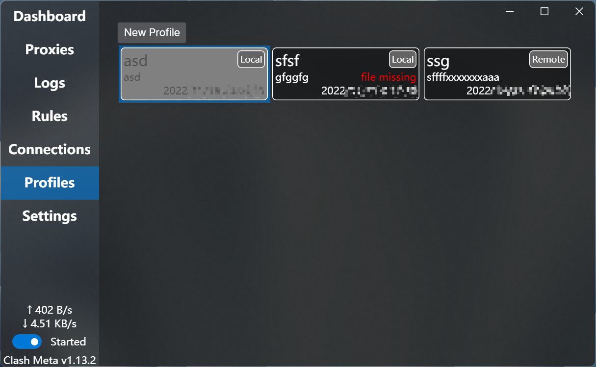
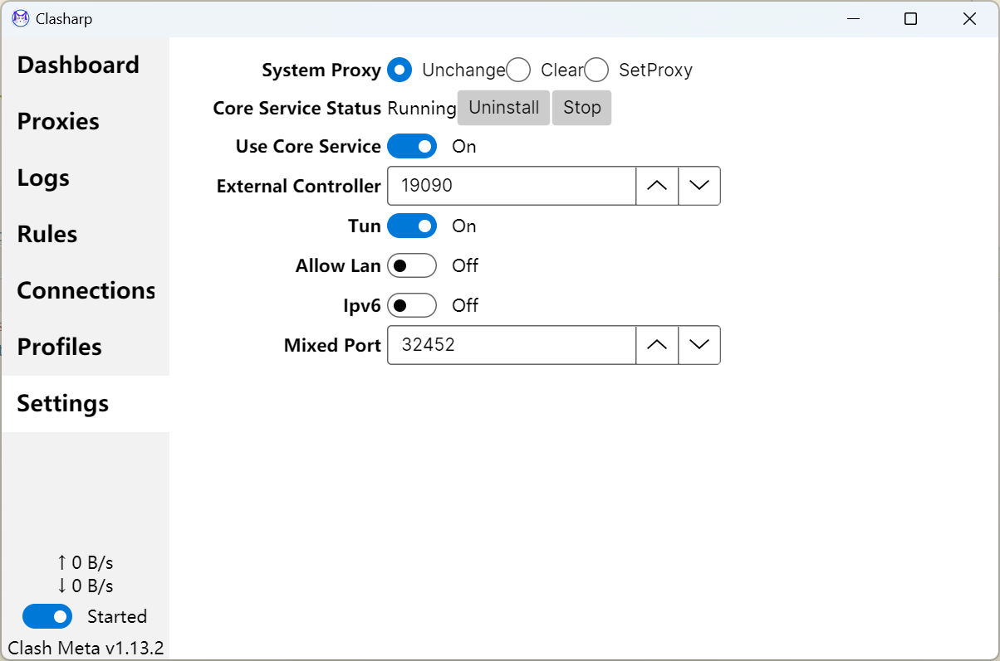
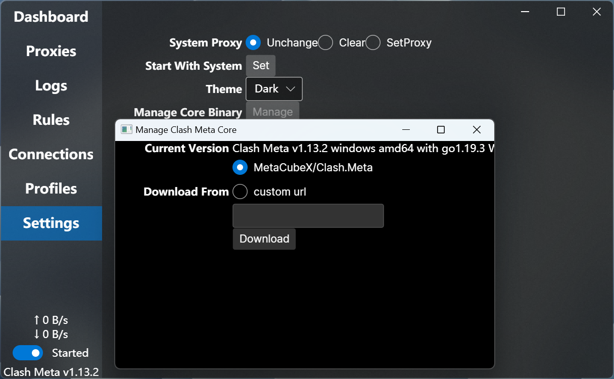

<h1 align="center">
  
   Clasharp 
</h1>

<h3 align="center">A clash meta kernel GUI written in C#</h3>

Clasharp uses [Meta Kernel](https://github.com/MetaCubeX/Clash.Meta) as backend.

This is a WIP project.

## Disclaimer

This is a learning project for C# / Avalonia cross platform gui practice.

Please comply with local laws and regulations.

## Screenshots

## Roadmap
- [x] Clash API
- [x] Clash CLI
  - [x] Start
  - [x] Stop
- [ ] User Interface
  - [x] Dashboard
    - [x] Traffic Stats
    - [x] Connections Stats
    - [x] Traffic Chart
  - [x] Proxy Groups
    - [x] Select Proxy
  - [x] Proxy Providers
      - [x] HealthCheck Proxy Provider
      - [x] Update Proxy Provider
  - [x] Rules
  - [x] Rules Providers
      - [x] Update Rules Provider
  - [x] Connections
    - [x] Sorting
    - [x] Close Connection
  - [x] Realtime Logs
  - [x] Clash Process Status
  - [x] Profiles
    - [x] List
    - [x] Select
    - [x] Edit
    - [x] Delete
  - [ ] Settings
    - [x] System Proxy
    - [x] TUN Mode
    - [x] Core Service Management
    - [x] Service Mode
    - [x] Allow Lan
    - [x] Ipv6
    - [x] External Controller
    - [x] Mixed Port
    - [x] Start With System
    - [x] Clash Core Management
  - [x] Subscriptions
    - [x] Update
- [x] Service Mode
  - [x] Install Core Service
  - [x] Uninstall Core Service
- [x] Service Mode (Linux)
  - [x] Install Core Service
  - [x] Uninstall Core Service
- [ ] Start with System
  - [ ] Windows
  - [x] Linux
- [ ] Builtin SubConverter
- [ ] Connect To Remote Backend
- [ ] Dark Theme
- [x] Clash Meta Core Management
  - [x] Download Core
  - [x] Custom Download Url
  - [ ] Check for Update
  - [ ] Auto Update for Alpha Kernel
- [ ] Self Update
- [x] Tray Icon
- [x] Set System Proxy
  - [x] Windows
  - [x] Linux
